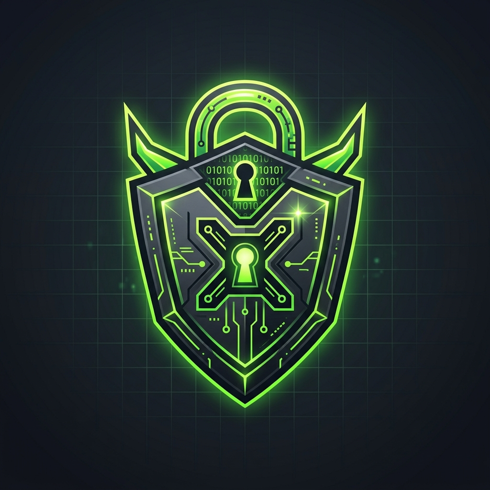

<p align="center">
  
</p>

# 🔓 InfraBreak: Exploitation Lab 01

**ECOM Offensive Cybersecurity Course | Hands-on CTF Lab**

Welcome to InfraBreak Lab 01! This is a multi-stage penetration testing challenge where you must piece together fragmented clues and chain various attack techniques to progress from unauthenticated network access all the way to root compromise.

## 🎯 Learning Objectives

By completing this lab, you will get hands-on practice with real-world scenarios, including:
- Network reconnaissance and service enumeration
- Identifying misconfigured default installations
- Offline data analysis and decryption
- Credential harvesting and reuse
- Lateral movement
- Local privilege escalation
- And more...

## 🗺️ Challenge Overview

The target server exposes several network services. Your primary objective is to **capture all 6 flags** by working through each stage of an interconnected attack chain. Each flag is carefully hidden in a location relevant to the specific technique used to bypass the previous hurdle. 

Keep your eyes open, enumerate thoroughly, and leave no stone unturned!

Flags will always follow the format: `ECOM{...}`

Submit your flags to the interactive **Flag Checker** web application running on the target server at port **8088** to track your progress and score.

## 🚀 Setup

### Requirements
- Docker installed on the host machine
- An offensive security OS like Kali Linux or Parrot OS (or the required toolset installed locally)

### Build & Run

```bash
# Clone the repository
git clone https://github.com/EcomSchool/infrabreak-lab01.git
cd infrabreak-lab01

# Build the container image (Note: ensure you build without cache to get the latest version)
docker build --no-cache -t infrabreak-lab01 .

# Run the container in detached mode
docker run -d --name infrabreak-lab01 \
  -p 21:21 \
  -p 22:22 \
  -p 3306:3306 \
  -p 5432:5432 \
  -p 8088:8088 \
  -p 40000-40010:40000-40010 \
  infrabreak-lab01
```

### Target IP

If you are running the Docker container locally on your own machine, the target IP is simply **`127.0.0.1`**.

> Note: If the lab is hosted on a remote VM, you will need to use that VM's assigned IP address.

## 🚩 Flags

There are **6 specific flags** to capture. Submit them into the Flag Checker portal as you find them!

Access the portal at: `http://127.0.0.1:8088` (or the IP of your VM).

## 📄 Final Deliverable: Penetration Test Report

As you progress through the lab, you are strongly advised to document your findings and compile a professional **Penetration Testing (PT) Report**. Treating this like a real commercial engagement will maximize your learning!

Your report should include:
- **Detailed Explanations**: A step-by-step narrative of your attack paths.
- **Screenshots**: Visual proof of exploitation at each critical stage.
- **Vulnerability Breakdown**: An analysis of the specific flaws discovered.
- **Recommendations & Advisories**: Actionable mitigation advice on how the organization should secure their environment and patch the issues.

## 🔄 Reset the Lab

If you get stuck or accidentally corrupt the environment, you can reset the lab entirely back to a clean state:

```bash
docker stop infrabreak-lab01 && docker rm infrabreak-lab01
docker run -d --name infrabreak-lab01 ... (same run command above)
```

> Note: Certain cryptographic keys and session properties are safely regenerated on every container start.
